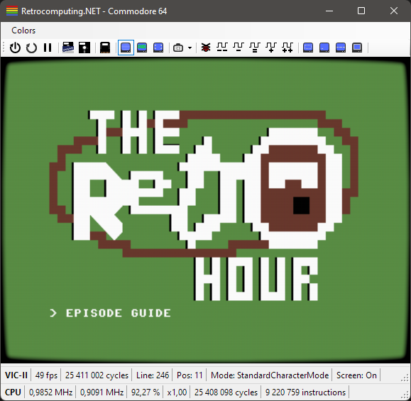
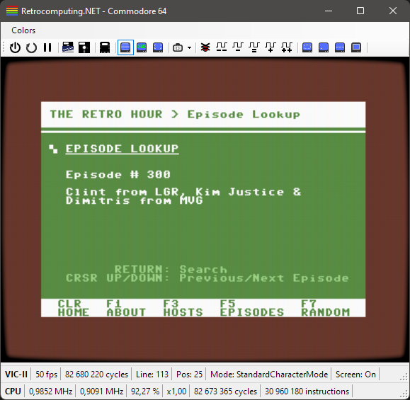
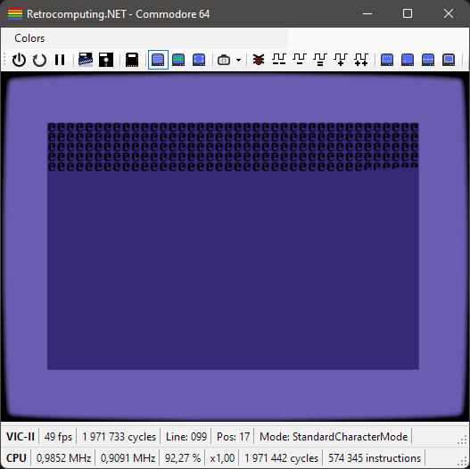

# The Retro Hour Commodore 64 Episode Guide

## Description

The Retro Hour Commodore 64 Episode Guide is a C64 program written in C for the Commodore 64 using the CC65 cross compiler. This is just another fun side project to learn more about the C64 and CC65.

## Features

- The Retro Hour Logo Splash Screen
- Information about The Retro Hour Podcast and the hosts
- Browse through the episode list
- Search for a specific episode
- Show a random episode
- Hidden Easter Egg
  - Code not comitted to GitHub yet
  - Can you figure out how to trigger it?

## Releases

A pre-compiled `PRG`-file can be found in the "Releases"-section on GitHub. You can run this file in any C64 emulator, even online; [https://c64online.com/c64-online-emulator/](https://c64online.com/c64-online-emulator/).

## Screenshots

*PETSCII "art" splash screen.*

*The "EPISODES (F5)" page showing the search results for `LGR`.*

*A `GIF` that shows the different pages and features.*

## Update Episode "Database"

Episodes are defined in an array inside `episodes.h`. The `CreateEpisodesHeaderFile.linq` file is a [**LINQpad**](https://www.linqpad.net/) script to automatically generate `episodes.h` from a "The Retro Hour" **RSS** feed.

## Build From Source

The easiest way to set up a development environment is to use a Linux system, Ubuntu on WSL2 or a CC65 Docker container.

### Steps

- Install the CC65 cross compiler
  - `sudo apt install cc65`
- Change to the directory of the `main.c` file
- Build with `cl65`
  - `cl65 main.c -o c64retrohour.prg`
- Run using any C64 emulator that accept a PRG-file
